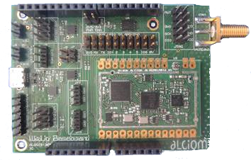

.. *****************************************************************************

*************************
Bienvenue sur OpenWize !
*************************

Qu'est-ce que Wize ?
=========================

Lancé en mars 2017 par GRDF, Suez et Sagemcom, Wize est un protocole ouvert dont le principe repose sur une communication à distance basse consommation, bas débit (entre 1200 et 6400 bits/s) et longue portée.

Les spécifications du protocole Wize sont maintenues au sein de la Wize Alliance, association à but non lucratif qui promeut l'adoption de ce protocole au sein des réseaux IOT dans le monde de l'industrie et des services publics urbains. En 2021, l'Alliance Wize comptera environ 40 membres.

Wize utilise des ondes radio sur une fréquence ouverte et libre de droits de 169 MHz en Europe afin d'assurer la meilleure pénétration possible pour la collecte de données de télémétrie dans le domaine de l'Internet des objets.

Toute la documentation du protocole est librement accessible sur le site de `Wize Alliance <https:\www.wize-alliance.com>`_, ainsi que toutes les informations nécessaires pour devenir membre en quelques clics.

Pourquoi une stack 169 MHz en open source ?
============================================

GRDF a débuté ses travaux sur la fréquence 169 MHZ en 2010 dans le cadre de son projet de télérelève des compteurs intelligents de gaz. L'enjeu pour GRDF était de mettre en place une infrastructure radio sur une bande de fréquence ouverte et libre en Europe, afin de permettre la télérelève des compteurs intelligents de gaz pour ses 11 millions de clients, en s'appuyant sur :

 * Une technologie fiable permettant de garantir un taux de relève journalier d'au moins 95%,
 * Une durée de vie de 20 ans pour les équipements fonctionnant sur batterie,
 * Une communication bidirectionnelle permettant l'envoi de commandes et le téléchargement à distance de micrologiciels à l'intérieur de ses capteurs,
 * une communication radio sûre et sécurisée de bout en bout.

Comme aucun LPWAN à l'époque (et c'est toujours le cas en 2023) ne pouvait répondre à toutes ces contraintes, GRDF a décidé de développer son propre protocole de communication radio, basé sur la norme W-MBUS mode N2 du comité technique européen 294, en intégrant les fonctionnalités qui manquaient à l'époque, à savoir la bidirectionnalité et les mécanismes de sécurisation de la communication.

Avec plus de 10 millions de compteurs déployés d'ici fin 2022 et au vu des excellentes performances obtenues avec la technologie mise en œuvre, GRDF a décidé de participer à la promotion de l'alliance wize en concevant et développant une stack protocolaire Wize 100% compatible avec les spécifications 1.2 de l'alliance et de publier ce développement en mode open source sous la licence MIT. 

Par cette publication, GRDF souhaite accélérer l'adoption de cette technologie par le plus grand nombre et faciliter la conception et la commercialisation d'un écosystème de capteurs IOT compatibles Wize le plus riche et le plus large possible pour répondre à ses propres besoins, ainsi qu'à ceux d'autres opérateurs industriels et gestionnaires de services publics urbains.

OpenWize, le nom donné à cette couche protocolaire, a été développé pour être le plus agnostique possible en termes de matériel.

Son architecture modulaire sous FreeRTOS permet cependant d'envisager un portage rapide vers une cible matérielle de son choix. En adoptant une approche open source, Wize vise à enrichir l'écosystème des membres de l'alliance Wize et soutiendra tous les contributeurs qui souhaitent s'investir dans l'amélioration fonctionnelle ou le portage d'OpenWize.

OpenWize est disponible en téléchargement, mais peut également être intégré dans un module matériel open source Wize'Up développé par la société Alciom (www.alciom.com). Dans cette dernière configuration, une entreprise qui découvre la technologie Wize, dispose de tous les éléments pour accélérer son projet IOT.

OpenWize est constitué d'un écosystème basé sur trois dépôts :

 * le dépôt `OpenWize`_ qui contient la stack elle-même et un exemple d'implémentation rapide.
 * le dépôt `OpenWize'Up`_ qui contient l'instanciation de la stack OpenWize sur la carte Wize'Up développée par un membre de l'Alliance Wize, la société ALCIOM.
 * le dépôt `banc_lib`_ qui contient un outil de test pour le protocole Wize avec le dispositif SmartBrick.

Les cartes de développement disponibles pour l'utilisation d'OpenWize
======================================================================

Wize'up : un module Wize performant et ouvert, la solution idéale pour développer simplement un produit compatible avec les LPWANs de Wize.

.. . figure:: pics/wize-up_board.png
..   :align: center
  
..   La carte Wize'up

   La carte Wize'Up montée sur son support

Wize'Up est le résultat d'un appel à projet de l'alliance wize, dans lequel Alciom et GRDF ont associé leurs compétences et leur expertise pour proposer une solution clé en main d'accélération des projets IOT. Le concept est de fournir un module de communication équipé d'OpenWize, facilement intégrable dans un nouveau design matériel. Ce module s'interface facilement via une liaison UART grâce à un ensemble de commandes AT. Pour plus d'informations sur `Wize'Up <https://www.alciom.com/nos-métiers/produits/wizeup/>`_

Pour plus d'informations sur l'implémentation de la stack OpenWize sur la carte Wize'Up : (rajouter lien car l'index du readTheDocs de OpenWize'Up)

Vous trouverez également dans le paragraphe :ref:`Demo application` un exemple simple d'utilisation d'OpenWize sur une carte de démonstration STM Nucléo L476RG qui ne possède pas de transceiver RF (la trame est émise sur un UART de la carte).

Quels réseaux 169 MHz utiliser avec la technologie Wize ?
==========================================================

Wize est une technologie qui peut être utilisée à la fois en mode "dédié" et en mode "opéré".

En mode "dédié", un client décide d'installer sa propre infrastructure de hubs Wize et s'enregistre en tant qu'opérateur auprès de l'alliance Wize. Si vous développez un produit pour un tel client, celui-ci vous fournira toutes les informations nécessaires pour enregistrer votre produit sur son réseau.

En mode "opéré", un client décide d'utiliser le réseau d'un opérateur existant pour envoyer les données de ses capteurs vers son système d'information. Si vous développez un produit pour un client de ce type, votre client doit vous mettre en relation avec l'opérateur wize qu'il a sélectionné afin que vous puissiez enregistrer votre produit sur son réseau. La liste des opérateurs wize ainsi que les points de contact associés sont disponibles sur le site de l'alliance.

A noter qu'à partir de la version 1.2, pour faciliter le développement des produits wize, l'alliance wize a introduit le concept Wiz'One qui permet de transmettre des données sur tous les réseaux wize compatibles 1.2 à des fins de tests unitaires ou d'intégration. Le support Wiz'One dépend de l'opérateur et peut être associé à certaines restrictions en termes de fonctionnalités.

Pour aller plus loin dans votre développement
=============================================

Besoin d'aide ?
Vous pouvez contacter Marvin JEANNOT

Guide de contribution à OpenWize.
=================================

Les contributions à OpenWize - corrections de bugs, ajout de nouvelles fonctionnalités, ajout de documentation, ajout d'exemples - sont les bienvenues. Ces contributions doivent être faites sous la forme d'une Pull Request sur Github.

Prérequis pour contribuer : (:ref:`Contribuer<Contributing>`)
 * Contribuer sous la même licence qu'OpenWize.
 * Votre code doit être conforme au style de développement d'OpenWize (:ref:`Guide de l'écriture du code<Coding Style Guide>`)
 * Votre code doit être conforme au style de documentation d'OpenWize (:ref:`Guide de l'écriture du code<Coding Style Guide>`)
 * Votre code doit être suffisamment documenté pour que sa structure soit facilement compréhensible.
 * Votre code est-il accompagné d'une documentation ou d'exemples qui facilitent la compréhension de son utilisation ?
 * Les commentaires et la documentation de votre code sont-ils rédigés en anglais ?

..
   User Guide to Writing Code
   --------------------------------
   TBD

   If you are unsure about any of these points, feel free to open an issue on the OpenWize repository to ask us your questions.

.. *****************************************************************************
.. references
.. _`STM32CubeIDE`: https://www.st.com/en/development-tools/stm32cubeide.html#get-software
.. _`Alciom` : https://www.alciom.com/en/home
.. _`Wize’Up`: https://www.alciom.com/en/our-trades/products/wizeup
.. _`OpenWize`: https://github.com/WizeEveryWhere/OpenWize
.. _`OpenWize'Up`: https://github.com/WizeEveryWhere/OpenWize-Up
.. _`banc_lib`: https://github.com/WizeEveryWhere/banc_lib
